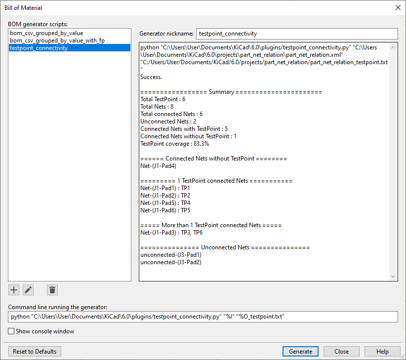

# KICAD xml Netlist parser for Testpoint connectivity

## - Description

This script has been developped following a request by user 'xzf16' on the [Kicad forum](https://forum.kicad.info/t/could-anyone-have-a-python-script-to-export-the-relationship-between-net-and-test-point/37024).<br>
The purpose of this script is to check if every net have a testpoint connected to it.<br>

Two versions exist :<br>
 * one as a standalone script called `netlist_tp_parser.py`
 * one as a Kicad plugin called `testpoint_connectivity.py`

## - Environnement
 * Python >=3.6 for standalone version
 * Kicad for plugin version, compatible with    
 * No specific Python module

## - Stand alone version

### -- usage

Execute the script with Python and by passing the netlist file in xml format as argument.
```shell
> python netlist_tp_parser.py

usage: netlist_tp_parser.py [-h] [--prefix component_prefix] netlist_file.xml
```

The argument `--prefix` may be used to specify the component reference prefix.<br>
If not specified, the default prefix is `TP` like Test Point.

```shell
> python3 netlist_tp_parser.py part_net_relation.xml
Component reference prefix to check: TP
Processing, please wait ...

================= Summary ======================
                  Total TestPoint : 6
                       Total Nets : 8
             Total connected Nets : 6
                 Unconnected Nets : 2
    Connected Nets with TestPoint : 5
 Connected Nets without TestPoint : 1
               TestPoint coverage : 83.3%

====== Connected Nets without TestPoint ========
Net-(J1-Pad4)

========= 1 TestPoint connected Nets ===========
Net-(J1-Pad1) : TP1
Net-(J1-Pad2) : TP2
Net-(J1-Pad5) : TP4
Net-(J1-Pad6) : TP5

===== More than 1 TestPoint connected Nets =====
Net-(J1-Pad3) : TP3, TP6

=============== Unconnected Nets ===============
unconnected-(J3-Pad1)
unconnected-(J3-Pad2)

```

## - Kicad plugin version

### -- Installation

To install the plugin script, copy the file `testpoint_connectivity.py` in the Kicad Plugin folder located
at the following path `C:\Users\[Username]\Documents\KiCad\X.0\plugins` (X correspond to the KiCad major version number).<br>
* <ins>For KiCad V6 and V7</ins><br>
In the Schematics editor, open the "Bill of material" window by either going to "Tools" -> "Generate Bill of Materials" or by clicking the "BOM" icon on the tools bar<br>
* <ins>For KiCad V8 and V9</ins><br>
In the Schematics editor, open the "Bill of material" window by going to "Tools" -> "Generate Legacy Bill of Materials"<br>

Then press the "+" button at the bottom of the screen and choose the plugin file you have just copied.<br>
When asked for the nickname, go with the default, the "Bill of material" window

### -- Usage

In the "Bill of material" window, click on `testpoint_connectivity` in the BOM generators scripts list and click on the `Generate` button.<br>
A printout with the summary results will be displayed on right panel of the widow<br>
At the same time, the summary results will be written in a text file (`[project_name].txt`) created in your project folder.

Note that the script find the testpoints in the netlist by identifying a pattern at the beginning of their reference.<br>
If for any reason you need to change the testpoint reference prefix, you can edit the script `testpoint_connectivity` and change the content of the prefix variable.<br>

`prefix = "TP"`
<br><br>



## - Versions

Last version: https://github.com/Peboli/kicad_netlist_tp_parser  

## - Author
Olivier Cornet aka Peboli on Github

## - License
This script is [MIT licensed](https://github.com/Peboli/kicad_netlist_tp_parser/blob/main/LICENSE)
